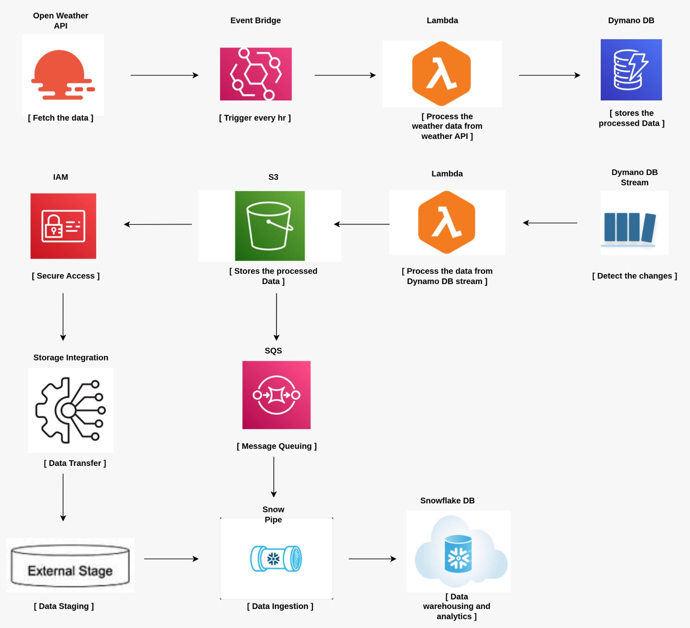
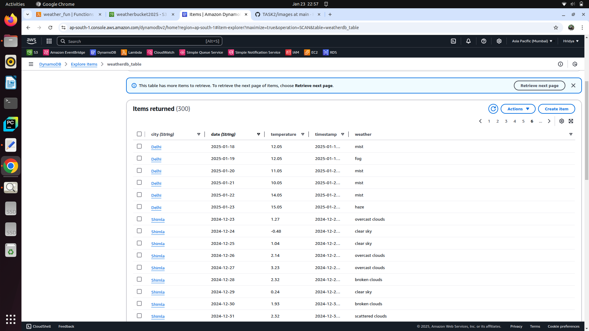
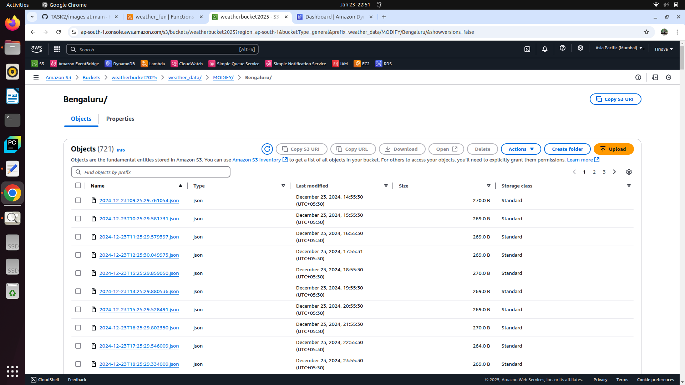
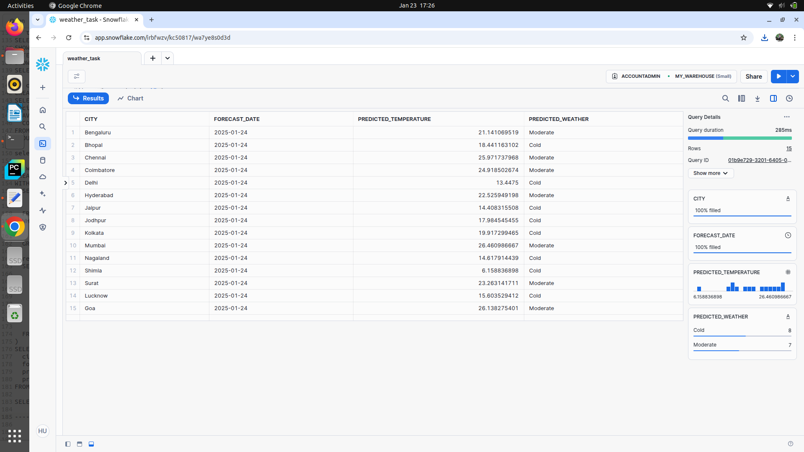

# Real_time_weatherdata_Pipeline
---
This project showcases a fully automated data pipeline using the powers of AWS like Eventbridge, Lambda, Dynamo DB, S3 and Snowflake. It entails designing and implementing a real-time weather data pipeline to process and analyse the weather updates. The objective is to enable predictive insights for weather pattern.

The starting point of this task is to create a weather api and access api keys to collect real-time weather data like city name, temperature, weather and timestamp of taregetd location. 

An event bridge is initiated to trigger thelambda function hourly and scheduling the events.

The row data is processed through the lambda function and stored in the Dynamo DB.

Dynamo DB stream tracks the changes in the table. 
Once the data in added, modified or deleted from the table the Dynamo DB stream detect it.
They trigger the next lambda function to archive the modified data into s3 bucket.

Storage integration Securely connects S3 with Snowflake for seamless data transfer.
In the process s3 serves as an external stage for snowflake.
For the automatic and continuous ingestion of data from s3 to snowflake table we created a snowpipe which is triggerd by the SQS queue. 

Fianlly calculate the average temperature and the weather forcast od each cities.

